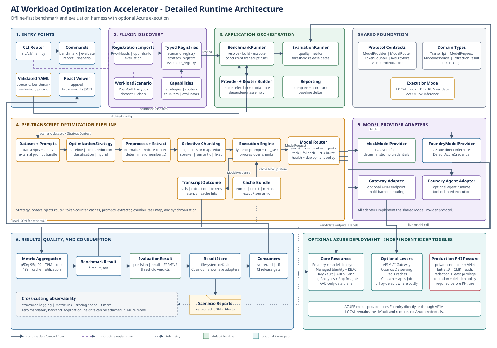

# Architecture Overview

The accelerator is a set of **independently importable modules** wired together
by typed registries and shared protocol contracts. There is no monolithic
package: each concern lives on its own and is unit-tested in isolation.

Solid arrows show runtime data or control flow. Dashed arrows show import-time
registration, and dotted arrows show cross-cutting telemetry. The green path is
the default credential-free local execution path; teal components are optional
Azure deployment resources.

## Module responsibilities

- **shared** — domain types, `Protocol` contracts, `pydantic` config schema and
  loaders. Everything else depends on this; it depends on nothing internal.
- **registry** — a generic `Registry[T]` plus typed scenario/strategy/evaluator
  registries. Capabilities are discovered by importing their module.
- **foundry** — model catalog, token counting, and providers. A deterministic
  `MockModelProvider` is the default; `FoundryModelProvider` and the Azure
  OpenAI adapter are import-guarded so the harness runs offline.
- **optimization** — the optimization toolbox: chunking, caching, model routing,
  PTU sizing, and token-reduction strategies. All are registered and selectable
  by name from config.
- **workloads** — the `WorkloadScenario` abstraction and the first scenario,
  Call Center Post-Call Analytics, including synthetic data generation and
  member-ID extraction.
- **benchmarking** — measures throughput, latency (p50/p95/p99), token usage,
  cost, 429 rate, cache hit rate, and utilization.
- **evaluation** — measures quality (recall/precision/FPR/FNR, etc.) and applies
  release-gate `ThresholdRule`s.
- **storage** — pluggable result stores (filesystem by default).
- **observability** — logging, tracing spans, and metric sinks.
- **apps/ui** — a thin, optional, browser-only viewer for result JSON.

## Execution modes

`ExecutionMode` is `LOCAL` (mock provider, default), `DRY_RUN`, or `AZURE`. The
default path requires no Azure credentials.

## Data flow (benchmark)

1. CLI loads a self-contained `BenchmarkConfig` (references a `scenario`).
2. The scenario generates a synthetic, optionally labeled dataset.
3. The selected optimization strategy + router process each transcript through
   providers.
4. `BenchmarkRunner` aggregates metrics into a `BenchmarkResult` written as
   `*.result.json`.
5. `aiwoa report compare` (or the UI) diffs baseline vs optimized.
